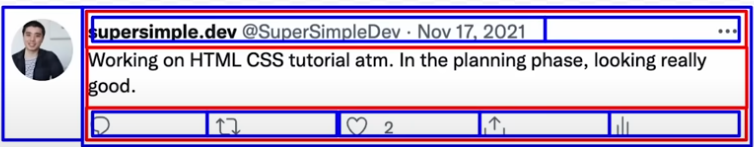

# Nested Layouts Technique
There are horizontal and vertical nested layouts that organize the looks of a container. Below are a few examples of nested layouts drawn in place.

#### YouTube video:

#### Twitter Post:

<u>**Key:**</u>
**Red:** Vertical Nested Layout
**Blue:** Horizontal Nested Layout